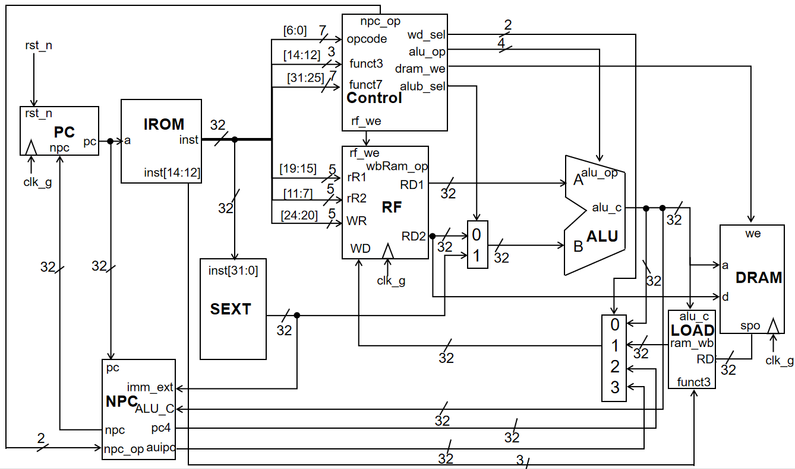
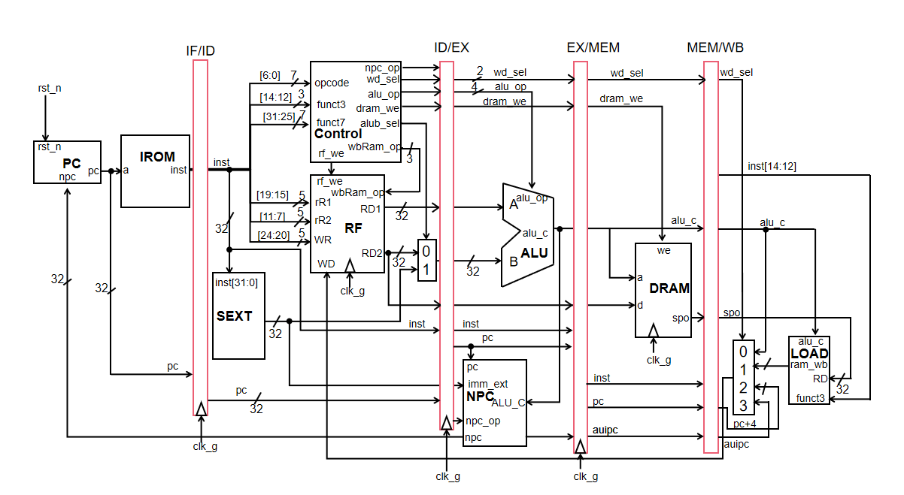
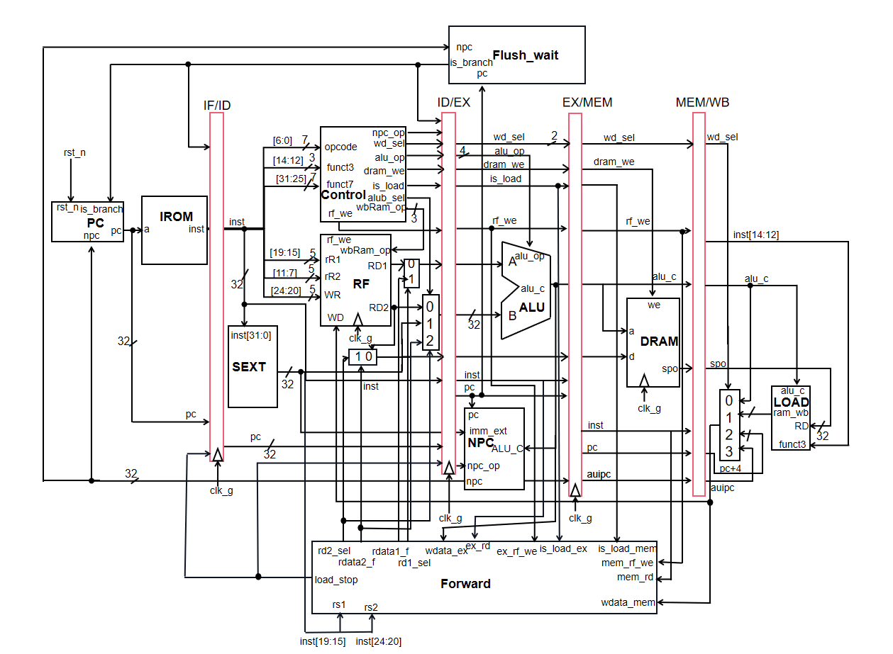

## readme

>- 单周期和流水线均可实现35条指令，其中单周期CPU频率为35MHz，流水线CPU频率为75MHz。（如果发现执行指令卡在2500000b或数码管显示其它奇怪数值，可适当降低频率）
>- 文件夹中的单周期仿真和流水线仿真均为可用于vivado进行仿真的工程项目。单周期的可跑trace的代码见本文件下方。
>- 路径含中文可能出bug

## 设计框图

### 单周期CPU设计图



### 流水线CPU设计图

- 流水线划分

  

- 整体框图

  


## CPU(trace代码)

>- verilog中的端口具有三种传输方向：input、output、和inout，所有的端口均默认为wire类型；
>- 模块描述时，input端口只能为线网形，output端口可以为线网/reg，inout端口只能为线网形；
>- 模块调用时（实例化模块时对应端口的信号），连接模块input端口的信号可以为线网/reg形，连接模块output端口的信号只能为线网，连接模块inout端口的信号也只能为线网形；

### 代码(实现25条指令)

##### top

```verilog
// Add your code here, or replace this file
module top(
    input clk,
    input rst_n,
    output        debug_wb_have_inst,   // WB阶段是否有指令 (对单周期CPU，此flag恒为1)
    output [31:0] debug_wb_pc,          // WB阶段的PC (若wb_have_inst=0，此项可为任意值)
    output        debug_wb_ena,         // WB阶段的寄存器写使能 (若wb_have_inst=0，此项可为任意值)
    output [4:0]  debug_wb_reg,         // WB阶段写入的寄存器号 (若wb_ena或wb_have_inst=0，此项可为任意值)
    output [31:0] debug_wb_value        // WB阶段写入寄存器的值 (若wb_ena或wb_have_inst=0，此项可为任意值)
);
    wire clk_g;                 // 25MHz的时钟信号
    wire locked;            
    reg[31:0] npc;      // 下一指令地址
    wire[31:0] wire_npc;

    reg[31:0] pc=1'b0;       // 当前PC
    wire[31:0] wire_pc;
    wire[31:0] inst;            // 当前指令
    wire[31:0] immediate;  // 扩展后的立即数
    wire[1:0] npc_op;     // 下一地址控制信号
    wire alub_sel;         // 第二个操作数选择控制信号
    wire[3:0] alu_op;   // ALU执行的操作
    wire[1:0] wd_sel;     // 写回数据的选择信号
    wire dram_we;          // 数据存储器写使能信号
    wire rf_we;            // 寄存器堆写使能信号
    wire[31:0] alu_c;           // 计算结果
    wire[31:0] pc4;             // pc+4
    wire[31:0] auipc;             // pc+imm_ext
    wire[31:0] RD;       // 从RAM中读出的数据
    wire[31:0] rD1;             // 第一个操作数
    wire[31:0] rD2;             // 第二个操作数
    // wire[31:0] mem_ad;      // ram的地址
    wire[31:0] ram_wb;

    always @(*)begin
        pc = wire_pc;
        npc = wire_npc;
    end


    assign debug_wb_have_inst = 1'b1;
    assign debug_wb_pc = pc;
    assign debug_wb_ena = rf_we;
    assign debug_wb_reg = inst[11:7];

    assign debug_wb_value = (wd_sel == 2'b00) ? alu_c :
							(wd_sel == 2'b01) ? ram_wb :             //lhu lw
							(wd_sel == 2'b10) ? pc4 :
                            (wd_sel == 2'b11) ? auipc: 0;

                            // ((inst[14:12]==3'b000)?({{24{RD[7]}},RD[7:0]}):     // lb
                            //                      (inst[14:12]==3'b100)?(RD[7:0]):                   // lbu
                            //                      (inst[14:12]==3'b001)?({{16{RD[15]}},RD[15:0]}):   // lh
                            //                      (inst[14:12]==3'b101)?(RD[15:0]):RD)

    
    // assign mem_ad = (inst[14:12] == 3'b010) ? (alu_c >> 2) : alu_c;

    // assign debug_wb_value = RD;
        // 改变时钟
    // cpuclk u_cpuclk (
    //     .clk_in1    (clk),
    //     .clk_out1    (clk_g),
    //     .locked     (locked)
    // );
    assign clk_g = clk;

    // always @(posedge rst_n)begin
    //     pc = 1'b0;
    //     npc = 1'b0;
    // end
        

    // load指令读出数据处理
    LOAD u_LOAD(
        .funct3     (inst[14:12]),
        .RD         (RD),
        .ram_wb     (ram_wb),
        .alu_c      (alu_c)
    );
    // 更新PC
    PC u_PC(
        .clk    (clk_g),
        .rst_n  (rst_n),
        .npc    (npc),
        .pc     (wire_pc)
    );
    
    // 立即数扩展
    SEXT u_SEXT(
        .inst   (inst),
        .imm    (immediate)
    );
    
    // ALU
    ALU u_ALU (
        .RD1    (rD1),
        .RD2    (rD2),
        .alub_sel   (alub_sel),
        .imm_ext    (immediate),
        .alu_op     (alu_op),
        .alu_c      (alu_c)
    );
    
    // 控制信号
    Control u_Control(
        .opcode     (inst[6:0]),
        .funct3     (inst[14:12]),
        .funct7     (inst[31:25]),
        .inst30     (inst[30]),   
        .npc_op     (npc_op),
        .alub_sel   (alub_sel),
        .alu_op     (alu_op),
        .wd_sel     (wd_sel),
        .dram_we    (dram_we),
        .rf_we      (rf_we)
    );
    
    // NPC
    NPC u_NPC(
        .imm_ext     (immediate),
        .ALU_C      (alu_c),
        .pc         (pc),
        .npc_op     (npc_op),
        .npc        (wire_npc),
        .pc4        (pc4),
        .auipc      (auipc)
    );
    
    //RF
    RF u_RF (
        .clk        (clk_g),
        .rR1        (inst[19:15]),
        .rR2        (inst[24:20]),
        .WR         (inst[11:7]),
        .WD0         (alu_c),
        .WD1         (ram_wb),
        .WD2         (pc4),
        .WD3        (auipc),  
        .wd_sel     (wd_sel),
        .rf_we      (rf_we),
        .RD1        (rD1),
        .RD2        (rD2)

    );
    // 下面两个模块，只需要实例化并连线，不需要添加文件
    inst_mem imem(
        .a      (pc >> 2),   // input wire [13:0] a
        .spo    (inst)   // output wire [31:0] spo
    );

    data_mem dmem(
        .clk    (clk_g),            // input wire clk_g
        .a      (alu_c >> 2),            // input wire [13:0] addra
        .spo    (RD),        // output wire [31:0] douta
        .we     (dram_we),          // input wire [0:0] wea
        .d      (rD2)         // input wire [31:0] dina
    );
endmodule

```

##### PC

```verilog
`timescale 1ns / 1ps
//////////////////////////////////////////////////////////////////////////////////
// Company: 
// Engineer: 
// 
// Create Date: 2022/06/24 10:59:37
// Design Name: 
// Module Name: PC
// Project Name: 
// Target Devices: 
// Tool Versions: 
// Description: 
// 
// Dependencies: 
// 
// Revision:
// Revision 0.01 - File Created
// Additional Comments:
// 
//////////////////////////////////////////////////////////////////////////////////


module PC(
    input wire clk,
    input wire rst_n,
    input wire[13:0] npc,
    output reg[13:0] pc
    );
    reg flag = 1'b0;
    // reg[13:0] pc_reg;
    // assign pc = pc_reg;
    always @(posedge clk)begin
        // if(flag)begin
        //     pc = npc;
        //     flag = 1'b0;
        // end
        // else if(rst_n && !flag) begin
        //     pc = 1'b0;
        //     flag = 1'b1;
        // end
        
        // flag = 0;
        if(flag && rst_n) begin
            pc = npc;
        end
        else if(!flag)begin
            pc = 1'b0;
            flag = 1'b1;
            // flag = 1'b0;
            // pc = 0;
        end
    end
    always @(posedge rst_n)begin
        pc = 1'b0;
        flag = 1'b0;
    end
    
endmodule

```


##### RF

```verilog
`timescale 1ns / 1ps
//////////////////////////////////////////////////////////////////////////////////
// Company: 
// Engineer: 
// 
// Create Date: 2022/06/24 18:26:05
// Design Name: 
// Module Name: RF
// Project Name: 
// Target Devices: 
// Tool Versions: 
// Description: 
// 
// Dependencies: 
// 
// Revision:
// Revision 0.01 - File Created
// Additional Comments:
// 
//////////////////////////////////////////////////////////////////////////////////


module RF(
	input clk,
	input [4:0] rR1,
	input [4:0] rR2,
	input [4:0] WR,
	input reg[31:0] WD0,
	input reg[31:0] WD1,
	input reg[31:0] WD2,
	input [1:0] wd_sel,
	input rf_we,	//使能端，读写信号
	output reg[31:0] RD1,
	output reg[31:0] RD2
	);
    reg [31:0] regts[1:31];


//读端口1读端口2用两个独立的always模块来实现
//读端口1
	always @(*)	//组合逻辑电路，只要有输入马上就有输出
	begin
		if(rR1==5'b00000)	//$0号寄存器只保存0
		begin
			RD1=32'b0;
		end
		else
		begin
			RD1=regts[rR1];
		end 
	end
	
	//读端口2
	always @(*)
	begin
	   if(rR2==5'b00000)	//$0号寄存器只保存0
		begin
			RD2=32'b0;
		end
		else
		begin
			RD2=regts[rR2];
		end
	end
	
	//写端口
	always @(posedge clk)	//脉冲信号作用下才能写
	begin
		if( (rf_we==1'b1) && (WR!=5'b00000) ) 	//判断使能端是否为1。是否为0号地址，0号不可写
		begin	
		    if(wd_sel == 2'b00)begin
		        regts[WR]=WD0;
		    end
		    else if(wd_sel == 2'b01)begin
		        regts[WR]=WD1;
		    end
		    else if(wd_sel == 2'b10)begin
		        regts[WR]=WD2;
		    end
		    else begin
		    end
			
		end
    end

endmodule

```


##### Control

```verilog
`timescale 1ns / 1ps
//////////////////////////////////////////////////////////////////////////////////
// Company: 
// Engineer: 
// 
// Create Date: 2022/06/24 11:39:04
// Design Name: 
// Module Name: Control
// Project Name: 
// Target Devices: 
// Tool Versions: 
// Description: 
// 
// Dependencies: 
// 
// Revision:
// Revision 0.01 - File Created
// Additional Comments:
// 
//////////////////////////////////////////////////////////////////////////////////


module Control(
    input wire[6:0] opcode,
    input wire[2:0] funct3,
    input wire[6:0] funct7,
    input wire inst30,
    output wire[1:0] npc_op,
    output wire alub_sel,
    output reg[3:0] alu_op,
    output wire[1:0] wd_sel,
    output wire dram_we,
    output wire rf_we
    );
    
    parameter ADD = 4'b0000;
    parameter SUB = 4'b0001;
    parameter AND = 4'b0010;
    parameter OR = 4'b0011;
    parameter XOR = 4'b0100;
    parameter SLL =4'b0101;
    parameter SRL = 4'b0110;
    parameter SRA = 4'b0111;
    parameter BEQ = 4'b1000;
    parameter BNE = 4'b1001;
    parameter BLT = 4'b1010;
    parameter BGE = 4'b1011;
    parameter LUI = 4'b1100;
   
   //选择下一地址的控制信号，01表示npc=rs1+offset，10表示npc=pc+offset，00表示pc+4
    assign npc_op[1:0] = (opcode==7'b1100111) ? (2'b01) :                                // jalr
                     (opcode==7'b1101111) ? (2'b10) :                               // J型指令
                     (opcode==7'b1100011) ? (2'b11) : (2'b00);// B型或 其它类型
    // 第二个操作数的选择信号，I/S/U型指令选择立即数，其余选择rs2                 
    assign alub_sel = (opcode==7'b0010011 || opcode==7'b0000011 || opcode==7'b1100111 || opcode==7'b0100011 || opcode==7'b0110111) ? 1'b1 : 1'b0;
    
//    assign alu_op = (opcode==7'b0110011 && funct3 == 3'b000 && funct7[5]==1'b1) ? 4'b0001 :4'b000;
    always @(*)begin
        // R型指令
        if(opcode == 7'b0110011)begin
            case(funct3)
                3'b000: alu_op = (inst30==1'b0) ? ADD : SUB;
                3'b001: alu_op = SLL;
                3'b100: alu_op = XOR;
                3'b101: alu_op = (inst30==1'b0) ? SRL : SRA;   
                3'b110: alu_op = OR;    
                3'b111: alu_op = AND;            
            endcase   
        end
        else if(opcode == 7'b0010011)begin
            case(funct3)
                3'b000: alu_op = ADD;
                3'b001: alu_op = SLL;
                3'b100: alu_op = XOR;
                3'b101: alu_op = (inst30==1'b0) ? SRL : SRA;   
                3'b110: alu_op = OR;    
                3'b111: alu_op = AND;            
            endcase   
        end
        else if(opcode == 7'b0000011 || opcode == 7'b1100111 || opcode == 7'b0100011)begin //lw jalr S型
            alu_op = 4'b0000;
        end
        else if(opcode == 7'b1100011)begin                                                  // B型
            case(funct3)
                3'b000: alu_op = BEQ;
                3'b001: alu_op = BNE;
                3'b100: alu_op = BLT;
                3'b101: alu_op = BGE;             
            endcase
        end
        else if(opcode == 7'b0110111)begin
            alu_op = LUI;
        end
    end    
    // 写回寄存器的数据控制信号
    assign wd_sel = (opcode==7'b0000011) ? 2'b01 :  //lw指令
                    (opcode == 7'b1101111 || opcode == 7'b1100111) ? 2'b10 : 2'b00; // jal指令、jalr指令，其它指令
    
    // 存储器写使能信号
    assign dram_we = (opcode == 7'b0100011) ? 1'b1 : 1'b0;  //   sw的ram写使能信号为1，其它为0
    
    // 寄存器写使能信号
    assign rf_we = (opcode == 7'b0100011 || opcode == 7'b1100011) ? 1'b0 :1'b1; // B型和S型寄存器写使能信号为0，其余为1
    
    
    
    
    
    
    
    
    
    
    
    
    
endmodule

```


##### SEXT

```verilog
`timescale 1ns / 1ps
//////////////////////////////////////////////////////////////////////////////////
// Company: 
// Engineer: 
// 
// Create Date: 2022/06/24 13:15:27
// Design Name: 
// Module Name: SEXT
// Project Name: 
// Target Devices: 
// Tool Versions: 
// Description: 
// 
// Dependencies: 
// 
// Revision:
// Revision 0.01 - File Created
// Additional Comments:
// 
//////////////////////////////////////////////////////////////////////////////////


module SEXT(
    input wire[31:0] inst,
    output wire[31:0] imm
    );

    assign imm = ((inst[14:12] == 3'b001 || inst[14:12] == 3'b101)&&(inst[6:0]==7'b0010011)) ? inst[24:20] : //移位指令
                  (inst[6:0]==7'b0010011 || inst[6:0]==7'b0000011 || inst[6:0]==7'b1100111) ? {{20{inst[31]}}, inst[31:20]} : // 其它I型指令
                  (inst[6:0]==7'b0100011) ? {{20{inst[31]}}, inst[31:25], inst[11:7]} :                                    // S型指令
                  (inst[6:0]==7'b1100011) ? {{20{inst[31]}},inst[7],inst[30:25], inst[11:8],1'b0} :                              // B型指令
                  (inst[6:0]==7'b0110111) ? {inst[31:12], 12'b0} :                                                         // lui
                  (inst[6:0]==7'b1101111) ? {{12{inst[31]}},inst[31],inst[19:12],inst[20], inst[30:21],1'b0} :  1'b0;                     // jal
                  
    
    
    
    
    
endmodule

```


##### NPC

```verilog
`timescale 1ns / 1ps
//////////////////////////////////////////////////////////////////////////////////
// Company: 
// Engineer: 
// 
// Create Date: 2022/06/24 11:01:16
// Design Name: 
// Module Name: NPC
// Project Name: 
// Target Devices: 
// Tool Versions: 
// Description: 
// 
// Dependencies: 
// 
// Revision:
// Revision 0.01 - File Created
// Additional Comments:
// 
//////////////////////////////////////////////////////////////////////////////////


module NPC(
    input wire[31:0] imm_ext,
    input wire[31:0] ALU_C,
    input wire[13:0] pc,
    input wire[1:0] npc_op,
    output wire[13:0] npc,
    output wire[13:0] pc4
    );
    assign pc4 = pc + 3'd4;
    assign npc = (npc_op == 2'b00) ? (pc+3'd4) :
                  (npc_op == 2'b01) ? ALU_C :
                  (npc_op == 2'b10) ? (pc+imm_ext) :
                  (npc_op == 2'b11) ? ((ALU_C == 1'b1) ? (pc+imm_ext): (pc+(3'd4))): 1'b0;
    
    
    
    
    
    
    
    
endmodule

```


##### ALU

```verilog
`timescale 1ns / 1ps
//////////////////////////////////////////////////////////////////////////////////
// Company: 
// Engineer: 
// 
// Create Date: 2022/06/24 11:55:12
// Design Name: 
// Module Name: ALU
// Project Name: 
// Target Devices: 
// Tool Versions: 
// Description: 
// 
// Dependencies: 
// 
// Revision:
// Revision 0.01 - File Created
// Additional Comments:
// 
//////////////////////////////////////////////////////////////////////////////////


module ALU(
    input wire [31:0] RD1,
    input wire [31:0] RD2,
    input wire alub_sel,
    input wire [31:0] imm_ext,
    input wire [3:0] alu_op,
    output reg [31:0] alu_c

    );
    parameter ADD = 4'b0000;
    parameter SUB = 4'b0001;
    parameter AND = 4'b0010;
    parameter OR = 4'b0011;
    parameter XOR = 4'b0100;
    parameter SLL =4'b0101;
    parameter SRL = 4'b0110;
    parameter SRA = 4'b0111;
    parameter BEQ = 4'b1000;
    parameter BNE = 4'b1001;
    parameter BLT = 4'b1010;
    parameter BGE = 4'b1011;
    parameter LUI = 4'b1100;
    reg temp[31:0];
    always @(*) begin
        case(alu_op)
            ADD: alu_c = RD1 + (alub_sel ? imm_ext : RD2);
            SUB: alu_c = RD1-RD2;
            AND: alu_c = RD1 & (alub_sel ? imm_ext : RD2);
            OR : alu_c = RD1 | (alub_sel ? imm_ext : RD2);
            XOR: alu_c = RD1 ^ (alub_sel ? imm_ext : RD2);
            SLL: alu_c = RD1 << (alub_sel ? imm_ext : RD2%32);
            SRL: alu_c = RD1 >> (alub_sel ? imm_ext : RD2%32);
            SRA: begin
                if(alub_sel)begin
                    // if(RD1)begin
                    //     alu_c = (RD1 >> imm_ext);
                    //     temp = {{imm_ext{1'b1}},{(32-imm_ext){1'b0}}};
                    //     alu_c = alu_c ^ temp;
                    // end
                    // else begin
                    //     alu_c = RD1 >> imm_ext;
                    // end
                    alu_c = ( $signed(RD1) ) >>> imm_ext;
                end
                else begin
                    // if(RD1)begin
                    //     alu_c = (RD1 >> (RD2%32));
                    //     temp = {{(RD2%32){1'b1}},{(32-RD2%32){1'b0}}};
                    //     alu_c = alu_c ^ temp;
                    // end
                    // else begin
                    //     alu_c = RD1 >> RD2%32;
                    // end
                    alu_c = ( $signed(RD1) ) >>> RD2%32;
                end
                // alu_c = RD1 >>> (alub_sel ? imm_ext : RD2%32);//( $signed(B) ) >>> A;
            end
            BEQ: alu_c = (RD1==RD2) ? 1 :0;
            BNE: alu_c = (RD1==RD2) ? 0 :1;
            BLT: alu_c = (($signed(RD1))<($signed(RD2))) ? 1 :0;
            BGE: alu_c = (($signed(RD1))>=($signed(RD2))) ? 1 :0;
            LUI: alu_c = imm_ext;
        endcase
    end
endmodule

```


### 代码(实现35条指令)

>还差sb和sh

##### top

```verilog
// Add your code here, or replace this file
module top(
    input clk,
    input rst_n,
    output        debug_wb_have_inst,   // WB阶段是否有指令 (对单周期CPU，此flag恒为1)
    output [31:0] debug_wb_pc,          // WB阶段的PC (若wb_have_inst=0，此项可为任意值)
    output        debug_wb_ena,         // WB阶段的寄存器写使能 (若wb_have_inst=0，此项可为任意值)
    output [4:0]  debug_wb_reg,         // WB阶段写入的寄存器号 (若wb_ena或wb_have_inst=0，此项可为任意值)
    output [31:0] debug_wb_value        // WB阶段写入寄存器的值 (若wb_ena或wb_have_inst=0，此项可为任意值)
);
    wire clk_g;                 // 25MHz的时钟信号
    wire locked;            
    wire[31:0] npc;      // 下一指令地址
    wire[31:0] pc=1'b0;       // 当前PC
    wire[31:0] inst;            // 当前指令
    wire[31:0] immediate;  // 扩展后的立即数
    wire[1:0] npc_op;     // 下一地址控制信号
    wire alub_sel;         // 第二个操作数选择控制信号
    wire[3:0] alu_op;   // ALU执行的操作
    wire[1:0] wd_sel;     // 写回数据的选择信号
    wire dram_we;          // 数据存储器写使能信号
    wire rf_we;            // 寄存器堆写使能信号
    wire[31:0] alu_c;           // 计算结果
    wire[31:0] pc4;             // pc+4
    wire[31:0] auipc;             // pc+imm_ext
    wire[31:0] RD;       // 从RAM中读出的数据
    wire[31:0] rD1;             // 第一个操作数
    wire[31:0] rD2;             // 第二个操作数
    // wire[31:0] mem_ad;      // ram的地址
    wire[31:0] ram_wb;


    assign debug_wb_have_inst = 1'b1;
    assign debug_wb_pc = pc;
    assign debug_wb_ena = rf_we;
    assign debug_wb_reg = inst[11:7];

    assign debug_wb_value = (wd_sel == 2'b00) ? alu_c :
							(wd_sel == 2'b01) ? ram_wb :             //lhu lw
							(wd_sel == 2'b10) ? pc4 :
                            (wd_sel == 2'b11) ? auipc: 0;

                            // ((inst[14:12]==3'b000)?({{24{RD[7]}},RD[7:0]}):     // lb
                            //                      (inst[14:12]==3'b100)?(RD[7:0]):                   // lbu
                            //                      (inst[14:12]==3'b001)?({{16{RD[15]}},RD[15:0]}):   // lh
                            //                      (inst[14:12]==3'b101)?(RD[15:0]):RD)

    
    // assign mem_ad = (inst[14:12] == 3'b010) ? (alu_c >> 2) : alu_c;

    // assign debug_wb_value = RD;
        // 改变时钟
    // cpuclk u_cpuclk (
    //     .clk_in1    (clk),
    //     .clk_out1    (clk_g),
    //     .locked     (locked)
    // );
    assign clk_g = clk;

    // always @(posedge rst_n)begin
    //     pc = 1'b0;
    //     npc = 1'b0;
    // end
        

    // load指令读出数据处理
    LOAD u_LOAD(
        .funct3     (inst[14:12]),
        .RD         (RD),
        .ram_wb     (ram_wb),
        .alu_c      (alu_c)
    );
    // 更新PC
    PC u_PC(
        .clk    (clk_g),
        .rst_n  (rst_n),
        .npc    (npc),
        .pc     (pc)
    );
    
    // 立即数扩展
    SEXT u_SEXT(
        .inst   (inst),
        .imm    (immediate)
    );
    
    // ALU
    ALU u_ALU (
        .RD1    (rD1),
        .RD2    (rD2),
        .alub_sel   (alub_sel),
        .imm_ext    (immediate),
        .alu_op     (alu_op),
        .alu_c      (alu_c)
    );
    
    // 控制信号
    Control u_Control(
        .opcode     (inst[6:0]),
        .funct3     (inst[14:12]),
        .funct7     (inst[31:25]),
        .inst30     (inst[30]),   
        .npc_op     (npc_op),
        .alub_sel   (alub_sel),
        .alu_op     (alu_op),
        .wd_sel     (wd_sel),
        .dram_we    (dram_we),
        .rf_we      (rf_we)
    );
    
    // NPC
    NPC u_NPC(
        .imm_ext     (immediate),
        .ALU_C      (alu_c),
        .pc         (pc),
        .npc_op     (npc_op),
        .npc        (npc),
        .pc4        (pc4),
        .auipc      (auipc)
    );
    
    //RF
    RF u_RF (
        .clk        (clk_g),
        .rR1        (inst[19:15]),
        .rR2        (inst[24:20]),
        .WR         (inst[11:7]),
        .WD0         (alu_c),
        .WD1         (ram_wb),
        .WD2         (pc4),
        .WD3        (auipc),  
        .wd_sel     (wd_sel),
        .rf_we      (rf_we),
        .RD1        (rD1),
        .RD2        (rD2)

    );
    // 下面两个模块，只需要实例化并连线，不需要添加文件
    inst_mem imem(
        .a      (pc >> 2),   // input wire [13:0] a
        .spo    (inst)   // output wire [31:0] spo
    );

    data_mem dmem(
        .clk    (clk_g),            // input wire clk_g
        .a      (alu_c >> 2),            // input wire [13:0] addra
        .spo    (RD),        // output wire [31:0] douta
        .we     (dram_we),          // input wire [0:0] wea
        .d      (rD2)         // input wire [31:0] dina
    );
endmodule

```

##### PC

```verilog
`timescale 1ns / 1ps
//////////////////////////////////////////////////////////////////////////////////
// Company: 
// Engineer: 
// 
// Create Date: 2022/06/24 10:59:37
// Design Name: 
// Module Name: PC
// Project Name: 
// Target Devices: 
// Tool Versions: 
// Description: 
// 
// Dependencies: 
// 
// Revision:
// Revision 0.01 - File Created
// Additional Comments:
// 
//////////////////////////////////////////////////////////////////////////////////


module PC(
    input wire clk,
    input wire rst_n,
    input wire[31:0] npc,
    output reg[30:0] pc         // 为什么PC模块这里的pc位数不能和top中的pc位数一样？
    );
    reg flag = 1'b0;
    // reg[13:0] pc_reg;
    // assign pc = pc_reg;
    always @(posedge clk)begin
        // if(flag)begin
        //     pc = npc;
        //     flag = 1'b0;
        // end
        // else if(rst_n && !flag) begin
        //     pc = 1'b0;
        //     flag = 1'b1;
        // end
        
        // flag = 0;
        if(flag && rst_n) begin
            pc = npc;
        end
        else if(!flag)begin
            pc = 1'b0;
            flag = 1'b1;
            // flag = 1'b0;
            // pc = 0;
        end
    end
    always @(posedge rst_n)begin
        pc = 1'b0;
        flag = 1'b0;
    end
    
endmodule

```


##### RF

```verilog
`timescale 1ns / 1ps
//////////////////////////////////////////////////////////////////////////////////
// Company: 
// Engineer: 
// 
// Create Date: 2022/06/24 18:26:05
// Design Name: 
// Module Name: RF
// Project Name: 
// Target Devices: 
// Tool Versions: 
// Description: 
// 
// Dependencies: 
// 
// Revision:
// Revision 0.01 - File Created
// Additional Comments:
// 
//////////////////////////////////////////////////////////////////////////////////


module RF(
	input clk,
	input [4:0] rR1,
	input [4:0] rR2,
	input [4:0] WR,
	input [31:0] WD0,
	input [31:0] WD1,
	input [31:0] WD2,
	input [31:0] WD3,
	input [1:0] wd_sel,
	input rf_we,	//使能端，读写信号
	output reg[31:0] RD1,
	output reg[31:0] RD2
	);
    reg [31:0] regts[1:31];


//读端口1读端口2用两个独立的always模块来实现
//读端口1
	always @(*)	//组合逻辑电路，只要有输入马上就有输出
	begin
		if(rR1==5'b00000)	//$0号寄存器只保存0
		begin
			RD1=32'b0;
		end
		else
		begin
			RD1=regts[rR1];
		end 
	end
	
	//读端口2
	always @(*)
	begin
	   if(rR2==5'b00000)	//$0号寄存器只保存0
		begin
			RD2=32'b0;
		end
		else
		begin
			RD2=regts[rR2];
		end
	end
	
	//写端口
	always @(posedge clk)	//脉冲信号作用下才能写
	begin
		if( (rf_we==1'b1) && (WR!=5'b00000) ) 	//判断使能端是否为1。是否为0号地址，0号不可写
		begin	
		    if(wd_sel == 2'b00)begin
		        regts[WR]=WD0;
		    end
		    else if(wd_sel == 2'b01)begin
				// case(wbRam_op)
				// 	3'b000: regts[WR] = {{24{WD1[7]}},WD1[7:0]};		// lb
				// 	3'b100: regts[WR] = WD1[7:0];						// lbu
				// 	3'b001: regts[WR] = {{16{WD1[15]}},WD1[15:0]};		// lh
				// 	3'b101: regts[WR] = WD1[15:0];						// lhu
				// 	3'b010: regts[WR] = WD1;							// lw
				// endcase
		        regts[WR]=WD1;
		    end
		    else if(wd_sel == 2'b10)begin
		        regts[WR]=WD2;
		    end
			else if(wd_sel == 2'b11)begin
		        regts[WR]=WD3;
		    end
		    else begin
		    end
			
		end
    end

endmodule

```


##### Control

```verilog
`include "param.v"
`timescale 1ns / 1ps
//////////////////////////////////////////////////////////////////////////////////
// Company: 
// Engineer: 
// 
// Create Date: 2022/06/24 11:39:04
// Design Name: 
// Module Name: Control
// Project Name: 
// Target Devices: 
// Tool Versions: 
// Description: 
// 
// Dependencies: 
// 
// Revision:
// Revision 0.01 - File Created
// Additional Comments:
// 
//////////////////////////////////////////////////////////////////////////////////


module Control(
    input wire[6:0] opcode,
    input wire[2:0] funct3,
    input wire[6:0] funct7,
    input wire inst30,
    output wire[1:0] npc_op,
    output wire alub_sel,
    output reg[3:0] alu_op,
    output wire[1:0] wd_sel,
    output wire dram_we,
    output wire rf_we
    );
    
//    parameter ADD = 4'b0000;
//    parameter SUB = 4'b0001;
//    parameter AND = 4'b0010;
//    parameter OR = 4'b0011;
//    parameter XOR = 4'b0100;
//    parameter SLL =4'b0101;
//    parameter SRL = 4'b0110;
//    parameter SRA = 4'b0111;
//    parameter BEQ = 4'b1000;
//    parameter BNE = 4'b1001;
//    parameter BLT = 4'b1010;
//    parameter BGE = 4'b1011;
//    parameter LUI = 4'b1100;
   
   //选择下一地址的控制信号，01表示npc=rs1+offset，10表示npc=pc+offset，00表示pc+4
    assign npc_op[1:0] = (opcode==7'b1100111) ? (2'b01) :                                // jalr
                     (opcode==7'b1101111) ? (2'b10) :                               // J型指令
                     (opcode==7'b1100011) ? (2'b11) : (2'b00);// B型或 其它类型
    // 第二个操作数的选择信号，I/S/U型指令选择立即数，其余选择rs2                 
    assign alub_sel = (opcode==7'b0010011 || opcode==7'b0000011 || opcode==7'b1100111 || opcode==7'b0100011 || opcode==7'b0110111) ? 1'b1 : 1'b0;
    
//    assign alu_op = (opcode==7'b0110011 && funct3 == 3'b000 && funct7[5]==1'b1) ? 4'b0001 :4'b000;
    always @(*)begin
        // R型指令
        if(opcode == 7'b0110011)begin
            case(funct3)
                3'b000: alu_op = (inst30==1'b0) ? `ADD : `SUB;
                3'b001: alu_op = `SLL;
                3'b100: alu_op = `XOR;
                3'b101: alu_op = (inst30==1'b0) ? `SRL : `SRA;   
                3'b110: alu_op = `OR;    
                3'b111: alu_op = `AND; 
                3'b010: alu_op = `BLT_SLT;       
                3'b011: alu_op = `SLTU;    
            endcase   
        end
        // I型指令
        else if(opcode == 7'b0010011)begin
            case(funct3)
                3'b000: alu_op = `ADD;
                3'b001: alu_op = `SLL;
                3'b100: alu_op = `XOR;
                3'b101: alu_op = (inst30==1'b0) ? `SRL : `SRA;   
                3'b110: alu_op = `OR;    
                3'b111: alu_op = `AND;     
                3'b010: alu_op = `BLT_SLT;   
                3'b011: alu_op = `SLTU;        
            endcase   
        end
        else if(opcode == 7'b0000011 || opcode == 7'b1100111 || opcode == 7'b0100011)begin //load jalr S型
            alu_op = 4'b0000;
        end
        else if(opcode == 7'b1100011)begin                                                  // B型
            case(funct3)
                3'b000: alu_op = `BEQ;
                3'b001: alu_op = `BNE;
                3'b100: alu_op = `BLT_SLT;
                3'b101: alu_op = `BGE;
                3'b110: alu_op = `BLTU;
                3'b111: alu_op = `BGEU;             
            endcase
        end
        else if(opcode == 7'b0110111)begin
            alu_op = `LUI;
        end
    end    
    // 写回寄存器的数据控制信号
    assign wd_sel = (opcode==7'b0000011) ? 2'b01 :  //load指令
                    (opcode == 7'b1101111 || opcode == 7'b1100111) ? 2'b10 :  // jal指令、jalr指令
                    (opcode == 7'b0010111) ? 2'b11 : 2'b00; // auipc，其它指令
    
    // 存储器写使能信号
    assign dram_we = (opcode == 7'b0100011) ? 1'b1 : 1'b0;  //   sw的ram写使能信号为1，其它为0
    
    // 寄存器写使能信号
    assign rf_we = (opcode == 7'b0100011 || opcode == 7'b1100011) ? 1'b0 :1'b1; // B型和S型寄存器写使能信号为0，其余为1
    

    
    
    
    
    
    
    
    
    
    
endmodule

```


##### SEXT

```verilog
`timescale 1ns / 1ps
//////////////////////////////////////////////////////////////////////////////////
// Company: 
// Engineer: 
// 
// Create Date: 2022/06/24 13:15:27
// Design Name: 
// Module Name: SEXT
// Project Name: 
// Target Devices: 
// Tool Versions: 
// Description: 
// 
// Dependencies: 
// 
// Revision:
// Revision 0.01 - File Created
// Additional Comments:
// 
//////////////////////////////////////////////////////////////////////////////////


module SEXT(
    input wire[31:0] inst,
    output wire[31:0] imm
    );

    assign imm = ((inst[14:12] == 3'b001 || inst[14:12] == 3'b101)&&(inst[6:0]==7'b0010011)) ? inst[24:20] : //移位指令
                  (inst[6:0]==7'b0010011 || inst[6:0]==7'b0000011 || inst[6:0]==7'b1100111) ? {{20{inst[31]}}, inst[31:20]} : // 其它I型指令
                  (inst[6:0]==7'b0100011) ? {{20{inst[31]}}, inst[31:25], inst[11:7]} :                                    // S型指令
                  (inst[6:0]==7'b1100011) ? {{20{inst[31]}},inst[7],inst[30:25], inst[11:8],1'b0} :                              // B型指令
                  (inst[6:0]==7'b0110111 || inst[6:0]==7'b0010111) ? {inst[31:12], 12'b0} :                                                         // lui
                  (inst[6:0]==7'b1101111) ? {{12{inst[31]}},inst[31],inst[19:12],inst[20], inst[30:21],1'b0} :  1'b0;                     // jal
                  
    
    
    
    
    
endmodule

```


##### NPC

```verilog
`timescale 1ns / 1ps
//////////////////////////////////////////////////////////////////////////////////
// Company: 
// Engineer: 
// 
// Create Date: 2022/06/24 11:01:16
// Design Name: 
// Module Name: NPC
// Project Name: 
// Target Devices: 
// Tool Versions: 
// Description: 
// 
// Dependencies: 
// 
// Revision:
// Revision 0.01 - File Created
// Additional Comments:
// 
//////////////////////////////////////////////////////////////////////////////////


module NPC(
    input wire[31:0] imm_ext,
    input wire[31:0] ALU_C,
    input wire[31:0] pc,
    input wire[1:0] npc_op,
    output wire[31:0] npc,
    output wire[31:0] pc4,
    output wire[31:0] auipc
    );
    assign pc4 = pc + 3'd4;
    assign auipc = pc + imm_ext;
    assign npc = (npc_op == 2'b00) ? (pc+3'd4) :
                  (npc_op == 2'b01) ? ALU_C :
                  (npc_op == 2'b10) ? (pc+imm_ext) :
                  (npc_op == 2'b11) ? ((ALU_C == 1'b1) ? (pc+imm_ext): (pc+(3'd4))): 1'b0;
    
    
    
    
    
    
    
    
endmodule

```


##### ALU

```verilog
`include "param.v"

`timescale 1ns / 1ps
//////////////////////////////////////////////////////////////////////////////////
// Company: 
// Engineer: 
// 
// Create Date: 2022/06/24 11:55:12
// Design Name: 
// Module Name: ALU
// Project Name: 
// Target Devices: 
// Tool Versions: 
// Description: 
// 
// Dependencies: 
// 
// Revision:
// Revision 0.01 - File Created
// Additional Comments:
// 
//////////////////////////////////////////////////////////////////////////////////


module ALU(
    input wire [31:0] RD1,
    input wire [31:0] RD2,
    input wire alub_sel,
    input wire [31:0] imm_ext,
    input wire [3:0] alu_op,
    output reg [31:0] alu_c

    );

//    `include "param.v"
//    parameter ADD = 4'b0000;
//    parameter SUB = 4'b0001;
//    parameter AND = 4'b0010;
//    parameter OR = 4'b0011;
//    parameter XOR = 4'b0100;
//    parameter SLL =4'b0101;
//    parameter SRL = 4'b0110;
//    parameter SRA = 4'b0111;
//    parameter BEQ = 4'b1000;
//    parameter BNE = 4'b1001;
//    parameter BLT = 4'b1010;
//    parameter BGE = 4'b1011;
//    parameter LUI = 4'b1100;
//    reg temp[31:0];
    always @(*) begin
        case(alu_op)
            `ADD: alu_c = RD1 + (alub_sel ? imm_ext : RD2);
            `SUB: alu_c = RD1-RD2;
            `AND: alu_c = RD1 & (alub_sel ? imm_ext : RD2);
            `OR : alu_c = RD1 | (alub_sel ? imm_ext : RD2);
            `XOR: alu_c = RD1 ^ (alub_sel ? imm_ext : RD2);
            `SLL: alu_c = RD1 << (alub_sel ? imm_ext : RD2%32);
            `SRL: alu_c = RD1 >> (alub_sel ? imm_ext : RD2%32);
            `SRA: begin
                if(alub_sel)begin
                    // if(RD1)begin
                    //     alu_c = (RD1 >> imm_ext);
                    //     temp = {{imm_ext{1'b1}},{(32-imm_ext){1'b0}}};
                    //     alu_c = alu_c ^ temp;
                    // end
                    // else begin
                    //     alu_c = RD1 >> imm_ext;
                    // end
                    alu_c = ( $signed(RD1) ) >>> imm_ext;
                end
                else begin
                    // if(RD1)begin
                    //     alu_c = (RD1 >> (RD2%32));
                    //     temp = {{(RD2%32){1'b1}},{(32-RD2%32){1'b0}}};
                    //     alu_c = alu_c ^ temp;
                    // end
                    // else begin
                    //     alu_c = RD1 >> RD2%32;
                    // end
                    alu_c = ( $signed(RD1) ) >>> RD2%32;
                end
                // alu_c = RD1 >>> (alub_sel ? imm_ext : RD2%32);//( $signed(B) ) >>> A;
            end
            `BEQ: alu_c = (RD1==RD2) ? 1 :0;
            `BNE: alu_c = (RD1==RD2) ? 0 :1;
            `BLT_SLT: alu_c = (($signed(RD1))<($signed(alub_sel ? imm_ext : RD2))) ? 1 :0;
            `BLTU: alu_c = (RD1<RD2) ? 1 :0;
            `BGE: alu_c = (($signed(RD1))>=($signed(RD2))) ? 1 :0;
            `BGEU: alu_c = (RD1>=RD2) ? 1 :0;
            `LUI: alu_c = imm_ext;
            `SLTU: alu_c = (RD1<(alub_sel ? imm_ext : RD2)) ? 1 :0;
            
        endcase
    end
endmodule

```

##### LOAD

```verilog
`timescale 1ns / 1ps
//////////////////////////////////////////////////////////////////////////////////
// Company: 
// Engineer: 
// 
// Create Date: 2022/06/30 11:42:16
// Design Name: 
// Module Name: LOAD
// Project Name: 
// Target Devices: 
// Tool Versions: 
// Description: 
// 
// Dependencies: 
// 
// Revision:
// Revision 0.01 - File Created
// Additional Comments:
// 
//////////////////////////////////////////////////////////////////////////////////


module LOAD(
    input [31:0] RD,
    input [2:0] funct3,
    input [31:0] alu_c,
    output reg[31:0] ram_wb

    );
    always @(*)begin
        if(alu_c % 3'd4 == 2'd2)begin
            case(funct3)
                3'b000: ram_wb = {{24{RD[23]}},RD[23:16]};     // lb
                3'b100: ram_wb = RD[23:16];                   // lbu
                3'b001: ram_wb = {{16{RD[31]}},RD[31:16]};     // lh
                3'b101: ram_wb = RD[31:16];                   // lhu
            endcase
        end
        else if(alu_c % 3'd4 == 2'd1)begin
            case(funct3)
                3'b000: ram_wb = {{24{RD[15]}},RD[15:8]};     // lb
                3'b100: ram_wb = RD[15:8];                   // lbu
                3'b001: ram_wb = {{16{RD[15]}},RD[23:8]};     // lh
                3'b101: ram_wb = RD[23:8];                   // lhu
            endcase
        end
        else if(alu_c % 3'd4 == 2'd3)begin
            case(funct3)
                3'b000: ram_wb = {{24{RD[31]}},RD[31:24]};     // lbu
                3'b100: ram_wb = RD[31:24];                   // lb
            endcase
        end
        else if(alu_c % 3'd4 == 2'd0)begin
            case(funct3)
                3'b000: ram_wb = {{24{RD[7]}},RD[7:0]};     // lb
                3'b100: ram_wb = RD[7:0];                   // lbu
                3'b001: ram_wb = {{16{RD[15]}},RD[15:0]};     // lh
                3'b101: ram_wb = RD[15:0];                   // lhu
                3'b010: ram_wb = RD;
            endcase
        end
    end
endmodule

```

##### param

```verilog
// file: param.v
`ifndef CPU_PARAM
`define CPU_PARAM

    // syntax: `define <macro name> <parameter>
    `define ADD 'b0000
    `define SUB 'b0001
    `define AND 'b0010
    `define OR  'b0011
    `define XOR 'b0100
    `define SLL 'b0101
    `define SRL 'b0110
    `define SRA 'b0111
    `define BEQ 'b1000
    `define BNE 'b1001
    `define BLT_SLT 'b1010
    `define BGE 'b1011
    `define LUI 'b1100
    `define SLTU 'b1101
    `define BLTU 'b1110
    `define BGEU 'b1111


    // `define STATE_IDLE 'b0001
    // `define STATE_WRIT 'b0010
    // `define STATE_WORK 'b0100
    // `define STATE_RETU 'b1000


`endif

```

